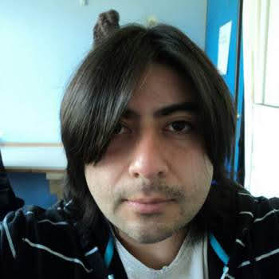

::: {.hero-grid}
::: {.hero-text}
# Investigación geofísica, modelación y aprendizaje automático informado por la física

Integro observaciones, productos satelitales, reanálisis, modelación numérica y aprendizaje automático para estudiar procesos hidroclimáticos y oceanográficos complejos.

Actualmente desarrollo investigación sobre floraciones algales nocivas en fiordos chilenos, con énfasis en turbulencia, transporte, estratificación y redes neuronales informadas por la física.

[Proyecto postdoctoral](projects/fondecyt-3261347.qmd){.btn .btn-primary} [Investigación](research.qmd){.btn .btn-outline-primary}
:::

::: {.hero-photo}
{fig-alt="Retrato de Francisco J. Alvial Vásquez"}
:::
:::

## Áreas de investigación

::: {.research-grid}
::: {.research-card}
### Física informada por datos

Redes neuronales informadas por la física, aprendizaje profundo y métodos híbridos para problemas geofísicos con observaciones limitadas.
:::

::: {.research-card}
### Oceanografía de fiordos

Turbulencia, mezcla vertical, estratificación, transporte y tiempo de residencia en sistemas costeros complejos.
:::

::: {.research-card}
### Floraciones algales nocivas

Integración de información atmosférica, oceanográfica, satelital e histórica para caracterizar y predecir condiciones favorables a eventos FAN.
:::

::: {.research-card}
### Hidroclimatología

Teledetección, reanálisis, modelación hidrológica y reducción de escala para construir campos ambientales de alta resolución.
:::
:::

## Proyecto destacado

::: {.project-highlight}
### Fondecyt de Postdoctorado 3261347

El proyecto desarrolla un marco de modelación para estudiar floraciones algales nocivas en fiordos chilenos mediante la integración de datos ambientales, simulaciones hidrodinámicas y restricciones físicas asociadas al transporte y la mezcla turbulenta.

**Etapa actual:** recopilación, control de calidad, armonización y evaluación de datos atmosféricos, oceanográficos, satelitales e históricos.

[Ver proyecto y avances](projects/fondecyt-3261347.qmd)
:::

## Perfil

Soy geofísico e investigador postdoctoral en la Universidad de Concepción. Mi trayectoria incluye hidroclimatología, desarrollo de productos ambientales de alta resolución, modelación numérica y aprendizaje automático aplicado a ciencias de la Tierra.

[Publicaciones](publications.qmd) · [Docencia](teaching.qmd) · [Contacto](contact.qmd) · [GitHub](https://github.com/fcoalvialv)
